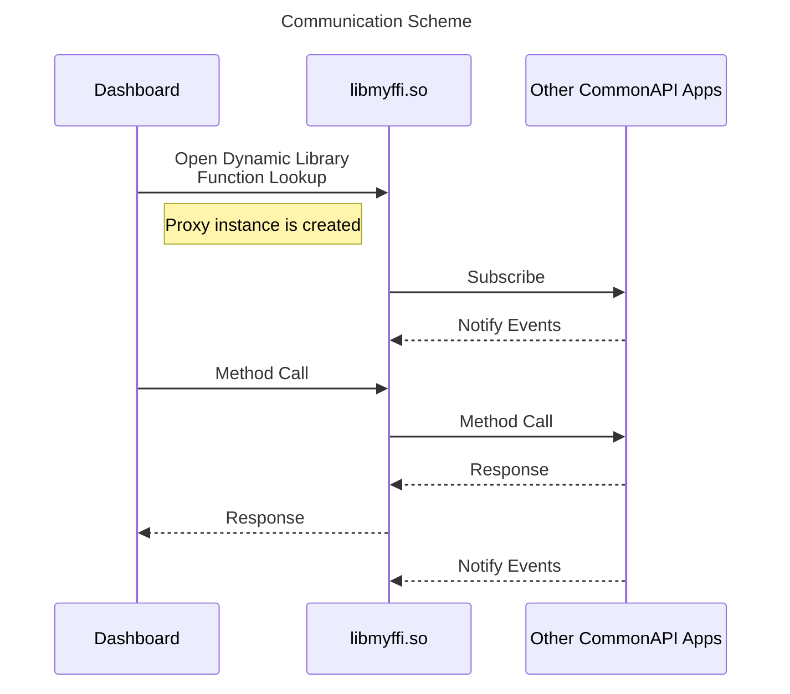

# Flutter Dashboard
This project is part of DES_03_Head-Unit and DES_04_PDC to provide instrument cluster feature.
Flutter was used to implement front end application.
It uses CommonAPI and SOME/IP binding as IPC

# Table of Contents
- [Features](#features)
- [Dependencies](#dendencies)
- [How it works](#how-it-works)
- [References](#references)

# Features

- Speedometer
- Current Gear
- Battery Info
- Clock
- Now Playing
- Turn Indicator
- Dark Mode
- Proximity Indicator

# Dendencies
All these applications should be installed in your build host to build this project
- [vSOME/IP](https://github.com/COVESA/vsomeip) v3.4.10
- [CommonAPI Core Runtime](https://github.com/COVESA/capicxx-core-runtime) v3.2.3
- [CommonAPI SOME/IP Runtime](https://github.com/COVESA/capicxx-someip-runtime) v3.2.3

# How it works
This application uses CommonAPI plugin to communicate with other applications.

 Each of the applications listed above provide proxy which will make it possible to subscribe to it's attributes. Since flutter does not have CommonAPI related libraries like dbus, I had to make a workaround using Foreign Function Interface(FFI). I created my own wrapper code to use CommonAPI proxies and modified CMakeLists.txt so that my flutter app will generate ffi shared object and include it in the bundle.
Now, flutter can use proxies and will subscribes to all of the attributes from each applications listed on the diagram by using ffi plugin in ffi folder. Once subscribed, ChangeNotifier will check for new values and update flutter widgets.

# References
- [DES_Instrument-Cluster](https://github.com/SEA-ME/DES_Instrument-Cluster)
- [DES_Head-Unit](https://github.com/SEA-ME/DES_Head-Unit)
- [DES_PDC](https://github.com/SEA-ME/DES_PDC-System)
- [CarControl](https://github.com/DES-Team-02/car_control)
- [CanTransceiver](https://github.com/DES-Team-02/CanTransceiver)
- [BatteryInfo](https://github.com/DES-Team-02/battery_info)
- [Flutter_Head-Unit](https://github.com/Lagavulin9/Flutter_Head-Unit)
- [vsomeip in 10 minutes](https://github.com/COVESA/vsomeip/wiki/vsomeip-in-10-minutes)
- [CommonAPI wiki](https://github.com/COVESA/capicxx-core-tools/wiki)
- [Flutter FFI](https://docs.flutter.dev/platform-integration/android/c-interop)
